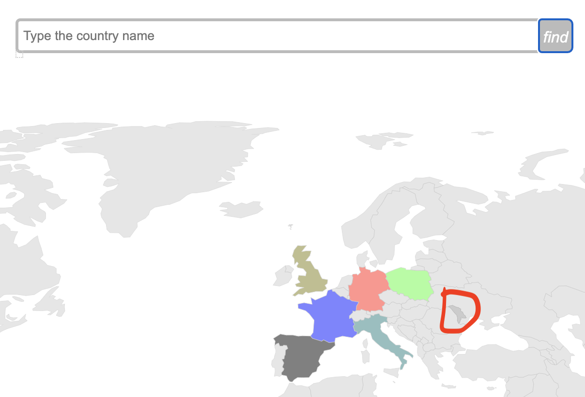

# где мы были

Проект представляет из себя интерактивную информационную карту (dashboard),
на которой вы и двое ваших друзей могут отмечать страны в которых вы были (или планируете попасть). К проекту нужно относиться не как к визуализации, которая о чем-то вас информирует или рассказывает историю, а как к инструменту, который позволяет вам рассказать свою уникальную историю о ваших путешествиях с друзьями! Поэтому источников данных здесь не будет, вы вводите данные сами.

## ограничения

Работает только десктопная версия, потому что пользоваться интерактивной картой с телефона крайне неудобно

## как пользоваться

При открытий проекта вы видите серую (еще не заполненную карту). Навигация по карте осуществляется стрелкой мыши.

При наведении на страну, возле стрелочки появляется ее название.

При клике на страну, вас перебросит на страницу Википедии об этой строне, чтобы вы могли узнать о ней больше, перед тем как планировать путешествие в желаемую страну.

При наведение на страну, она выделяется, в этот момент вы можете одну из 4 клавиш r, g, b или 0

- r - окрасит страну в красный цвет
- g - окрасит страну в зеленый цвет
- b - окрасит страну в синий цвет
- 0 - вернет серый цвет (на случай, если окрашивание произошло случайно)

## зачем окрашивать страны

По задумке за вами и вашими друзьями зарезервирован один из этих трех цветов.
Например, вы - красный, Иннокентий - синий, Иполит - зеленый. Таким образом, из картинки выше следует, что Иннокентий был во франции, вы в Германии, а Иполит в Польше.

Если вы хотите отметить, что Британию вы посетили вместе с Иннокентием, то сначала наведите курсор на Британию, нажмите r (ваш цвет), а затем b (цвет Иннокентием). Так ваши цвета смешаются (получится фиолетовый). Если в Италии вас не был, но был Иннокентий и Иполит, наведите на Италию и нажмите на g и b. Вот что должно получится:

Если вы внезапно вспомнили, что в Британии с вами все-таки был Иполит, наведите на Британию, нажмите 0, чтобы убрать старый цвет и снова нажмите r (ваш цвет) и g (цвет Иполита). Если вы решили все вместе махнуть в Испанию, наведите на Испанию и нажмите r, g, b. Получится вот так:

## зачем строка поиска

Если мы забыли где страна находится на карте - на помощь придет строка поиска. Начинайте вводить название на английском и автозаполнение поможет вам.

Кликните на нужное название и ано появится в строке поиска

нажмите кнопку find и вы увидете, что страна выделилась точно так же, как и при наведение курсора. Теперь можно ее окрашивать нажимая на r, g, b

Чтобы снять выделение снова нажмите find

## зачем нужен импорт и экспорт

Они нужны, чтобы запоминать введенные данные. Когда вы заполнили карту нажмите на `Export`

После этого появится ссылка на скачивание файла с данными о путешествиях вас и ваших друзей. Нажмите на ссылку и файл с названием `map.json` начнется скачиваться

Когда вы снова откроете карту после закрытия, она будет пустой, `map.json` понадобится, чтобы импортировать ваши дыннае обратно на карту.

Для этого нажмите на `Choose file`, загрузите `map.json` и после нажмите `Import`

Перед вами снова ваша карта!

___

Проект создавался на чистом JavaScript с небольшим использованием JQuery. Никакие специальные библиотеки для визуализации не были использованы.

Автор: Илья Сагайдак